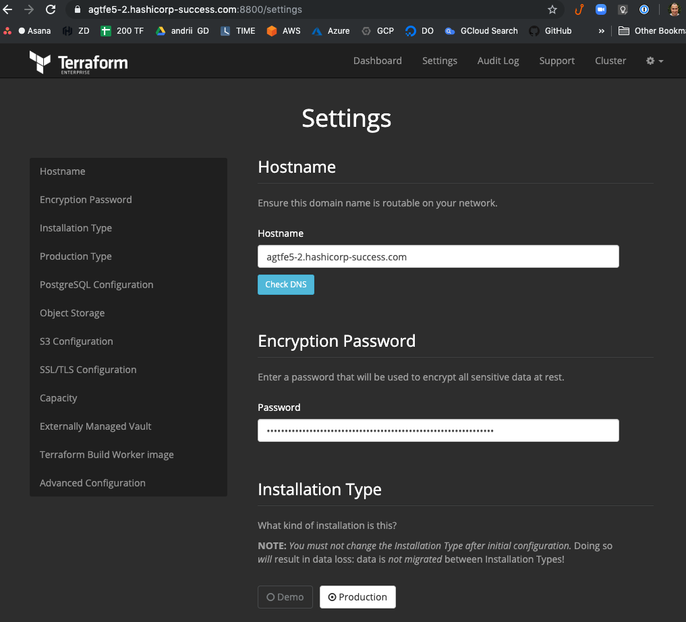
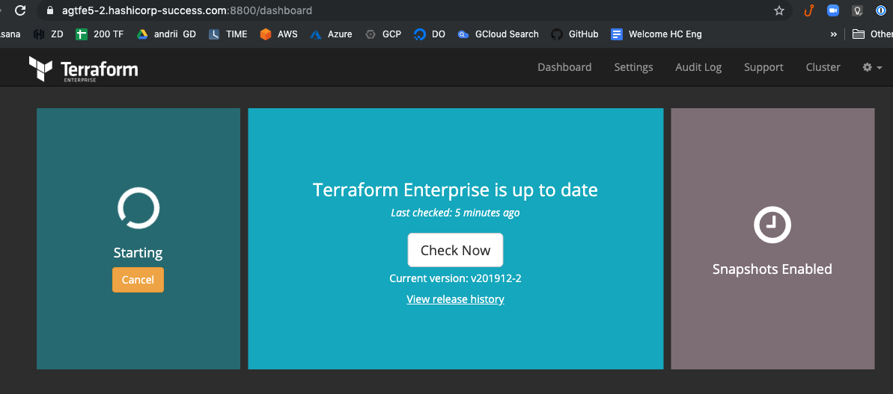
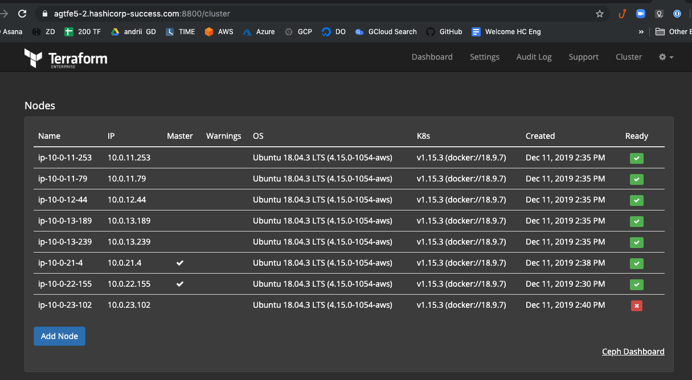
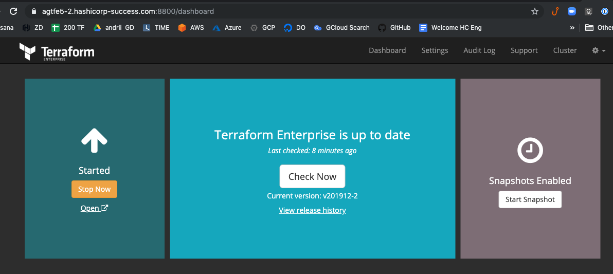
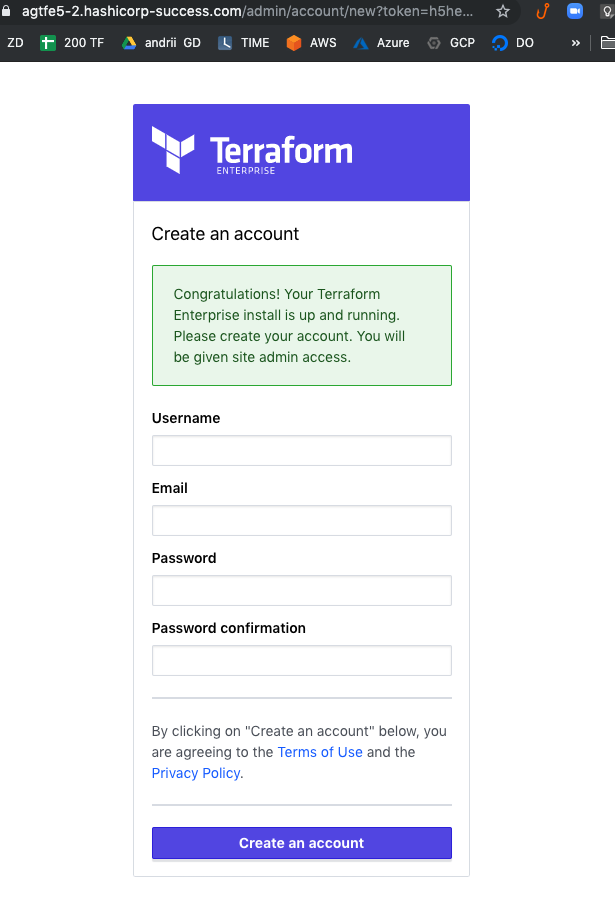

# tfev5-cluster-module-aws-demo
Demonstration of how to use HashiCorp's modules to setup basic TFE v5 cluster on AWSm with full required infra provision

**WARNING: Using of the infrastructure created by the code in this repo will imply some cost charge. This is NOT suitable for AWS Free Tier.**


# Requirements

This repository assumes general knowledge about Terraform, if not, please get yourself accustomed first by going through [getting started guide for Terraform](https://learn.hashicorp.com/terraform?track=getting-started#getting-started). We also going to use AWS EC2 as our infrastructure provider, AWS Route53 DNS service and Amazon-managed SSL Certificates.

**Please be aware, before doing anything that at the moment (in the transition period) to deploy TFE v5 in CLuster mode you will need to use Terraform v 0.11.X, not 12**

To learn more about the mentioned above tools and technologies -  please check section [Technologies near the end of the README](#technologies)

Please read also at first official parts of the manual  : 
- [Pre-install checklist](https://www.terraform.io/docs/enterprise/before-installing/index.html)
- [Deploying a Terraform Enterprise Cluster on AWS](https://www.terraform.io/docs/enterprise/install/cluster-aws.html)

As the last word - you also will need to have proper TFE v5 HA license at hand. In case you don't have it - please contact your technical account manager to obtain one. These licenses differ, from the one issued in the past by default, so, do not assume anything, ask support.


# How-to

## Prepare authentication credentials

- Prepare AWS auth credentials (You can create security credentials on [this page](https://console.aws.amazon.com/iam/home?#security_credential).) To export them via env variables, execute in the command line :
 ```
 export AWS_ACCESS_KEY_ID="YOUR ACCESS KEY"
 export AWS_SECRET_ACCESS_KEY="YOUR SECRET KEY"
 ```
You can choose any other way of authentication, but this manual assumes the one above. 
## Deploy infrastructure
- Clone this repo (*use the tools of your choice*)
- Open the folder with cloned repo

### Tune parameters for your case 
At least replace the `domain name` and `license file` with your own. 
- Define your domain name in [variables.tf](variables.tf), edit online 4, following block :
 ```terraform
 variable "site_domain" {
   default = "hashicorp-success.com"
 }
 ```
- Define your domain site (host) record in [variables.tf](variables.tf), edit on line 10, following block :
 ```terraform
 variable "site_record" {
   default = "agtfe5-2"
 }
 ```
- Define path to the file with yur license on lines : 45-47 : 
 ```terraform
 variable "license_file" {
   default = "andrii-hashicorp-emea.rli" 
 }
 ```
- You may also - change the regional setings or some prefixes, that's up to your preferences. 

- Install Terrafrom, version 0.11.x is required for the present moment.
You can follow instruction from Getting Started: https://learn.hashicorp.com/terraform/getting-started/install 
- From inside folder with cloned repo init Terraform by executing :
  ```
  terraform init
  ```
Example output can be found here : [terraform_init.md](terraform_init.md)

Now let's spin up infra for the TFE, we will do this in several stages

## Stage 1: VPC and networks

This stage utilizing module - Bootsrap AWS: https://github.com/hashicorp/private-terraform-enterprise/tree/master/examples/bootstrap-aws

- Execute : 
```bash
terraform apply -target=module.bootstrap_aws.module.new_vpc --auto-approve
```
> Note that we are using *targeted* apply, to have infra deliberately deployed before TFE and because we mixing all parts in one repository for the simplification. In a real environment, you should better have a network / VPC / DB / Storage layers as separate parts and projects. 

Example sanitized output (*passwords and sensitive information masqueraded*) can be found here : [terrafor_apply_network_layer.md](terrafor_apply_network_layer.md)


## Stage 2: External Services: Database and S3 Storage
This part using *"External Services"* module: https://github.com/hashicorp/terraform-aws-terraform-enterprise/tree/master/modules/external-services

- Execute : 
```bash
terraform apply -target=module.external.aws_rds_cluster_instance.tfe1 -auto-approve
```
> Again we are using *targeted* apply, in order to have infra deliberately deployed before TFE

Execution will take some time, this is usually the slowest part of the whole process as the creation of the DB can take 7-9 minutes easy.

Example sanitized output (*passwords and sensitive information masqueraded*) : [terraform_apply_ext_services.md](terraform_apply_ext_services.md)


> For your convenience both modules for stages 1 and 2  had been cloned and located now under the [modules](modules) folder in this repo. 


## Stage 3: Deployment of the Terraform Enterprise v5 cluster

We are going to create 3 primary and 5 secondary nodes.
This defined in the file [variables.tf](variables.tf) at lines 25-31

The module used here is the one referenced in the original manual: https://registry.terraform.io/modules/hashicorp/terraform-enterprise/aws/0.1.1

GitHub repository link to module code https://github.com/hashicorp/terraform-aws-terraform-enterprise

Execute : 
```bash
terraform apply --auto-approve
```
After some time you can see the outputs near the end of the installation : 

```bash
Apply complete! Resources: 53 added, 0 changed, 0 destroyed.

Outputs:

tfe-cluster = {
  application_endpoint = https://agtfe5-2.hashicorp-success.com
  application_health_check = https://agtfe5-2.hashicorp-success.com/_health_check
  iam_role = ptfe-es67ralybod
  install_id = es67raly
  installer_dashboard_password = merely-unethical-kangooroo
  installer_dashboard_url = https://agtfe5-2.hashicorp-success.com:8800
  primary_public_ip = 3.120.248.243
  ssh_private_key = /.../tfev5-cluster-module-aws-demo/work/agtf5-es67raly.priv
}
tfe-infra=details = {
  postgresql_address = tfe-es67doly20191211125600919200000003.cluster-c45sadhyh79j5.eu-central-1.rds.amazonaws.com
  postgresql_database = tfe
  postgresql_password = Al2XRKIaqJofHWzyTi3gW9g0hVaFc7dx67CWpn3k
  postgresql_user = tfe
}
```

From here you can visit the **Dashboard** at `installer_dashboard_url`, and use a password from `installer_dashboard_password` to unlock it. After unlocking you are going to be redirected to the settings page : 



At this moment TFE (as an application) is still starting. IF you go to the Dashboard link in the top menu, you could see something like this : 



For example, it can be that one node is still not completely, up, you can visit section Cluster, from the top menu and see such picture : 




When all required nodes and services are up, the main dashboard status going to change, to reflect this as follows : 



From here, you can press the link "Open" below the button [Stop Now] in the leftmost section, and start creating your first user and working with Terraform Enterprise : 



That concludes this small demo. Thank you.


# TODO

# DONE
- [x] define objectives
- [x] add code for infrastructure 
- [x] put all the proper links for modules in README
- [x] provision VPC + DB layer for TFE
- [x] install TFE v5 in Prod Cluster mode with external services
- [x] update README


# Run logs

- terraform init : [terraform_init.md](terraform_init.md)
- terraform apply for *network layer* infra creation  : [terrafor_apply_network_layer.md](terrafor_apply_network_layer.md)
- terraform apply for *external services* - DB and object storage (S3 bucket) : [terraform_apply_ext_services.md](terraform_apply_ext_services.md)
- terraform apply - TFE deploy  : [terraform_apply_ext_services.md](terraform_apply_tfe_deploy.md)
- terraform destroy : [terraform_destroy.md](terraform_destroy.md)


# Technologies

1. **To download the content of this repository** you will need **git command-line tools**(recommended) or **Git UI Client**. To install official command-line Git tools please [find here instructions](https://git-scm.com/book/en/v2/Getting-Started-Installing-Git) for various operating systems.

2. **For managing infrastructure** we using Terraform - open-source infrastructure as a code software tool created by HashiCorp. It enables users to define and provision a data center infrastructure using a high-level configuration language known as Hashicorp Configuration Language, or optionally JSON. More you encouraged to [learn here](https://www.terraform.io).
 - Specifically, we going to use Terraform for creating infrastructure, and install Terraform Enterprise. TFE Overview: can be found here: https://www.terraform.io/docs/enterprise/index.html
 - Pre-Install checklist: https://www.terraform.io/docs/enterprise/before-installing/index.html

3. **This project for virtualization** uses **AWS EC2** - Amazon Elastic Compute Cloud (Amazon EC2 for short) - a web service that provides secure, resizable compute capacity in the cloud. It is designed to make web-scale cloud computing easier for developers. You can read in details and create a free try-out account if you don't have one here : [Amazon EC2 main page](https://aws.amazon.com/ec2/)

